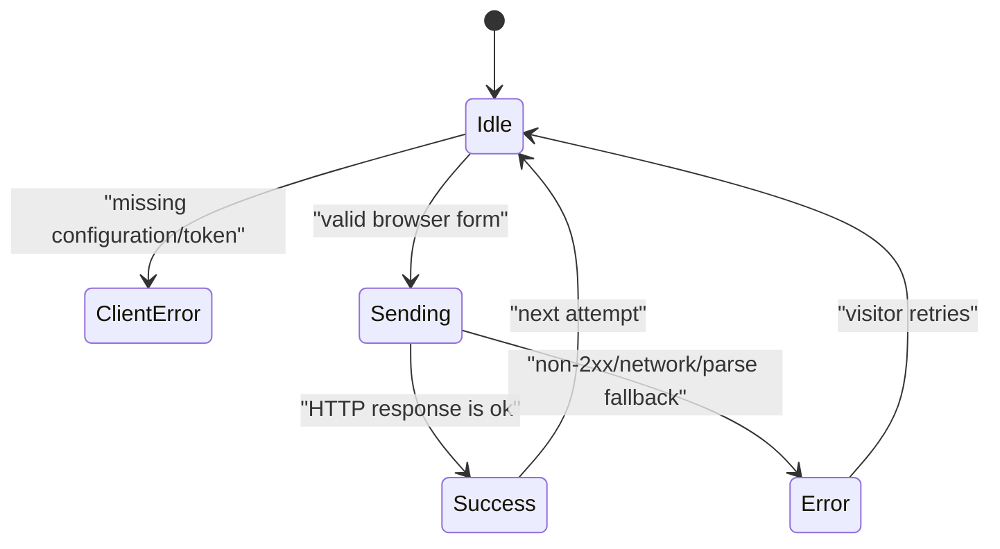
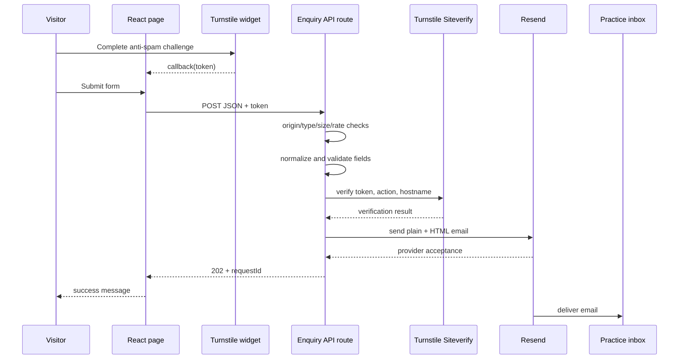

# Swaraagam frontend and full-stack handbook

> **Standalone handoff note:** Use [DEPLOY_YOURSELF.md](./DEPLOY_YOURSELF.md) as the source of truth for deployment. The active enquiry flow is D1-backed; a few historical sections in this learning handbook describe an earlier email-only version.

> **Audience:** a Java/Spring developer who is new to TypeScript, React, browser development, CSS, and the JavaScript build ecosystem.

This is the learning guide for the application. It explains not only *what* each file does, but *why* the code is shaped this way and how execution moves between the browser, server, and external providers. For a shorter day-to-day lookup, use [DEVELOPER_REFERENCE.md](./DEVELOPER_REFERENCE.md). Production launch work is tracked separately in [PRODUCTION_READINESS.md](./PRODUCTION_READINESS.md).

## 1. The application in one minute

Swaraagam is a public, single-page website for a therapy practice. It has two real integrations:

1. **Scheduling:** a link opens a Calendly event in a new tab.
2. **Enquiries:** a browser form sends an email to the practice through a server API.

The enquiry path is protected with Cloudflare Turnstile, server validation, a honeypot, origin checks, size limits, and a best-effort attempt limit.

The stack is:

```text
TypeScript language
    ↓
React components and hooks
    ↓
Next.js App Router conventions
    ↓
vinext + Vite build system
    ↓
Cloudflare Worker runtime
```

The page is not a Java SPA talking to a separate Spring Boot service. The UI and API route live in the same repository and are built into one Cloudflare application.

The application uses Drizzle ORM with Cloudflare D1. A valid enquiry is stored
before the application asks Resend to send its notification, so a temporary
email-provider failure does not discard the request.

## 2. The three execution environments

The most important frontend concept is understanding *where code runs*.

| Environment | Examples in this project | Can use | Must not use |
| --- | --- | --- | --- |
| Browser | interaction logic in `app/page.tsx` | `window`, `document`, DOM events, React state, public environment values | server secrets, D1 bindings |
| Cloudflare server | `app/api/enquiries/route.ts`, `app/layout.tsx` | secret environment values, outbound provider calls, request headers | browser DOM APIs |
| Build process | `vite.config.ts`, TypeScript, Tailwind processing | source files, build-time environment values, plugins | per-visitor state |

Some React page HTML may be produced on the server for the first response, but the interactive code still runs in the browser after hydration. That is why a Client Component needs to obey both rendering constraints and browser-runtime constraints.

### A Java analogy

Think of the boundaries this way:

- Browser React code is comparable to a rich Thymeleaf page plus its JavaScript, running on the user's machine.
- An API route is comparable to a small `@RestController` deployed in the same application.
- `worker/index.ts` is comparable to the runtime adapter that receives HTTP requests and dispatches them into the framework.
- Vite/vinext is comparable to a combination of Maven plugins, template compilation, asset bundling, and packaging.

Do not picture React state as a Spring bean. Each mounted browser component has its own private state.

## 3. Repository map

```text
new project 4/
├── app/
│   ├── api/
│   │   └── enquiries/
│   │       └── route.ts       # Server HTTP endpoint
│   ├── globals.css            # Theme, layout, components, breakpoints, animation
│   ├── layout.tsx             # Root HTML wrapper and SEO metadata
│   └── page.tsx               # Home page UI and all browser interactions
├── db/
│   ├── index.ts               # Optional Drizzle client factory
│   └── schema.ts              # Enquiry and shared rate-limit tables
├── drizzle/                   # Migration metadata
├── examples/d1/               # Reference example, not an active app route
├── public/                    # Static assets available from the site root
├── tests/
│   └── rendered-html.test.mjs # Built-Worker integration tests
├── worker/
│   └── index.ts               # Cloudflare Worker entry point
├── .env.example               # Safe configuration template
├── drizzle.config.ts          # Migration generator configuration
├── next.config.ts             # Next-compatible options
├── package.json               # Dependencies, metadata, and npm commands
├── tsconfig.json              # TypeScript compiler rules
├── vite.config.ts             # Build and local Cloudflare integration
└── wrangler.example.jsonc     # Standalone Worker deployment template
```

Do not manually edit generated/local directories:

- `node_modules/`: installed packages;
- `.vinext/`: framework build intermediates;
- `dist/`: production output;
- `.wrangler/`: local Cloudflare state and logs;
- `outputs/` and `work/`: generated work artifacts.

## 4. Java-to-TypeScript language guide

TypeScript is JavaScript plus a compile-time type system. The browser and Worker execute JavaScript; TypeScript types do not exist at runtime.

### 4.1 Variables

```ts
const service = "Counselling"; // reference cannot be reassigned
let attempts = 0;              // value may be reassigned
```

Prefer `const` unless reassignment is required. `const` does not make an object deeply immutable:

```ts
const person = { name: "Asha" };
person.name = "Mira"; // legal: the object changed, not the variable binding
```

There is also an older `var` keyword. Modern application code normally avoids it because its scoping rules are surprising.

### 4.2 Primitive values

Common TypeScript types are:

```ts
let name: string = "Asha";
let count: number = 3;       // JavaScript has one ordinary number type
let accepted: boolean = true;
let absent: null = null;
let missing: undefined = undefined;
```

JavaScript distinguishes `null` and `undefined`. `undefined` often means a property or argument was not supplied. This project uses TypeScript strict mode, so nullable values must be handled deliberately.

### 4.3 Type inference

Type annotations are often unnecessary:

```ts
const title = "Swaraagam"; // inferred as string
const limit = 5;           // inferred as number
```

This is not dynamically untyped code. The compiler still checks inferred types.

### 4.4 Objects and type aliases

The API defines a DTO-like shape:

```ts
type Enquiry = {
  name: string;
  email: string;
  service: string;
  note: string;
  turnstileToken: string;
};
```

Unlike a Java class, this declaration creates no constructor, methods, validation, or runtime type token. It only tells the compiler which properties code may use.

TypeScript is structurally typed. Any object with the required compatible properties can be treated as an `Enquiry`; it does not need to `implements Enquiry`.

### 4.5 Arrays and collection operations

```ts
const services = ["Counselling", "Musical Therapy"];

const labels = services.map((service) => service.toUpperCase());
const music = services.find((service) => service.includes("Music"));
const hasCounselling = services.some((service) => service === "Counselling");
```

`.map()` is similar to Java Stream `map(...).toList()`. `.filter()`, `.find()`, `.some()`, and `.every()` resemble familiar stream operations.

The UI uses `.map()` to convert modality data into React cards and process-step data into list items.

### 4.6 `Set` and `Map`

The server defines allowed service values in a `Set`:

```ts
const SERVICES = new Set(["Counselling", "Arts-Based Therapy"]);
SERVICES.has(service);
```

The attempt limiter uses a `Map<string, RateLimitEntry>`, comparable to a Java `Map<String, RateLimitEntry>`.

### 4.7 Functions and arrow functions

Named function:

```ts
function escapeHtml(value: string): string {
  return value.replace(/* ... */);
}
```

Arrow function:

```ts
const upper = (value: string) => value.toUpperCase();
```

Arrow functions are frequently passed as callbacks. This code:

```ts
entries.forEach((entry) => {
  if (entry.isIntersecting) {
    entry.target.classList.add("is-visible");
  }
});
```

means “for every entry, invoke this function.” It is similar to a Java lambda passed to `forEach`.

### 4.8 Template strings

Backticks create template strings:

```ts
const subject = `New Swaraagam enquiry — ${enquiry.service}`;
```

`${...}` evaluates an expression. Never confuse convenient interpolation with output safety: the API explicitly HTML-escapes visitor values before placing them into its HTML email.

### 4.9 Optional properties and optional chaining

```ts
type Result = { error?: string };
const message = result.error ?? "Default message";
const forwarded = request.headers.get("X-Forwarded-For")?.split(",")[0];
```

- `error?: string` means the property may be absent.
- `value?.method()` stops and returns `undefined` when `value` is nullish.
- `a ?? b` uses `b` only when `a` is `null` or `undefined`.

`??` differs from `||`: an empty string, zero, or `false` does not trigger the right side of `??`.

### 4.10 `unknown` versus `any`

The API accepts parsed input as `unknown`:

```ts
function parseEnquiry(input: unknown) { /* ... */ }
```

`unknown` is intentionally safe. Code must check that the value is an object and that properties have the expected types before using them. `any` disables much of the compiler and should be rare.

The custom `isPlainObject()` function is a type guard. After it returns true, TypeScript understands that `input` can be treated as a property map.

### 4.11 Modules

```ts
import { useState } from "react";
export default function Home() { /* ... */ }
```

Each source file is a module. `export` makes a declaration available to other modules; `import` consumes it. A default export can be imported under one chosen local name, while named exports use braces.

### 4.12 Promises and `async`/`await`

Network operations are asynchronous:

```ts
async function send(): Promise<void> {
  const response = await fetch("/api/enquiries");
  // This continues when the promise settles.
}
```

This resembles code written with `CompletableFuture`, but `await` makes the control flow linear. It does not block the entire browser or Worker thread while the network is pending.

An async function always returns a `Promise`, even if the annotation is omitted.

### 4.13 Errors

JavaScript allows throwing any value, so a caught value is not safely assumed to be an `Error`:

```ts
catch (error) {
  const message = error instanceof Error ? error.message : "Unknown failure";
}
```

The project uses this pattern in browser and server code.

## 5. The browser and the event loop

Browser JavaScript responds to events: initial page loading, clicks, form submissions, network completions, observer callbacks, and provider callbacks.

A simplified event sequence is:

```text
Render page
  → browser paints
  → effects install observers and Turnstile
  → visitor submits
  → handler starts fetch
  → browser remains responsive while fetch is pending
  → promise settles
  → handler updates state
  → React renders the changed UI
```

Long synchronous loops would still freeze the page. Network `await` does not, because the runtime can process other events while waiting.

## 6. React from first principles

### 6.1 A component is a function of inputs and state

At a conceptual level:

```text
UI = render(props, state)
```

`Home()` has no props, but it has React state. React calls it to obtain a new element description whenever relevant state changes.

Do not manually repaint an error message or submit button. Update state and let the render output describe the correct result.

### 6.2 JSX is not an HTML string

This JSX:

```tsx
<button disabled={isSubmitting}>
  {isSubmitting ? "Sending securely…" : "Send enquiry"}
</button>
```

is a typed description of an element. The ternary operator chooses the text for the current state. React reconciles the previous and next descriptions and applies the necessary DOM changes.

Important JSX rules:

- use `className` rather than `class`;
- use camelCase properties such as `tabIndex` and `autoComplete`;
- pass booleans as expressions, for example `disabled={isSubmitting}`;
- close every element;
- put JavaScript expressions inside `{}`;
- use fragments `<>...</>` when multiple elements need one wrapper without another DOM node.

### 6.3 Rendering is expected to be pure

A component render should calculate UI, not perform external actions. It may be called more than once.

Do not send email, modify the document, start timers, or fetch data directly in the component body. Use:

- an event handler for a visitor action;
- `useEffect` for synchronization after rendering;
- server code for protected operations.

### 6.4 State with `useState`

`Home()` creates:

```ts
const [isSubmitting, setIsSubmitting] = useState(false);
```

Read this as:

- `isSubmitting` is the state snapshot for this render;
- `setIsSubmitting` asks React to schedule a new state value and render.

Calling a setter does not mutate the current render's local variable. This matters when several statements run in one handler.

The page state is:

| State | Initial value | What reads it | What changes it |
| --- | --- | --- | --- |
| `submitted` | `false` | success-message condition | form submission lifecycle |
| `calendarNote` | `false` | Calendly fallback condition | scheduling fallback button |
| `isSubmitting` | `false` | button label, disabled state, `aria-busy` | `handleSubmit()` |
| `formError` | empty string | alert condition | Turnstile and submission callbacks |
| `turnstileToken` | empty string | submission guard/payload | Turnstile callbacks/reset |

### 6.5 References with `useRef`

A ref persists across renders but changing it does not request a new render.

```ts
const turnstileContainerRef = useRef<HTMLDivElement>(null);
const turnstileWidgetIdRef = useRef<string | null>(null);
```

The first ref is attached to JSX and becomes the real DOM element after rendering. Turnstile requires that element. The second stores an external widget identifier used for reset/removal; the ID does not affect visual output, so state is unnecessary.

### 6.6 Effects with `useEffect`

An effect synchronizes React with an external system:

```ts
useEffect(() => {
  // setup after mount
  return () => {
    // cleanup before unmount/re-setup
  };
}, []);
```

The dependency array tells React when setup must be repeated:

- no array: after every committed render;
- `[]`: once per mount;
- `[value]`: when `value` changes.

The first app effect creates an `IntersectionObserver`, observes elements with `data-reveal`, and disconnects it during cleanup.

The second app effect loads Turnstile, registers a script `load` listener, renders a widget, and removes both listener and widget during cleanup.

Cleanup prevents duplicate listeners, memory leaks, and callbacks targeting a component that no longer exists.

### 6.7 Conditional rendering

```tsx
{formError && <div role="alert">{formError}</div>}
```

When `formError` is an empty string, React renders nothing there. When it is non-empty, React renders the `<div>`.

The app also uses the ternary operator when there are two alternatives, such as a Calendly link versus a fallback button.

### 6.8 Rendering lists

```tsx
{modalities.map((item) => (
  <article key={item.title}>{item.title}</article>
))}
```

React uses `key` to track the identity of each repeated item. A stable domain identifier is best. Array indexes are risky when items can be inserted, removed, or reordered.

### 6.9 Hydration

The framework can send useful initial HTML before the app's JavaScript finishes loading. Hydration is the step where React attaches behaviour to that existing HTML.

Hydration requires the first browser render to agree with the server-produced markup. Avoid reading volatile browser-only values directly during render. This app confines `window` and `document` access to effects and event-time functions.

The footer year is derived from `new Date().getFullYear()`. That is normally stable during a request, though date-dependent initial rendering should always be considered around time-zone/year boundaries.

## 7. Next.js App Router conventions used here

Routing is based on file locations rather than annotations.

| File | URL/framework role |
| --- | --- |
| `app/page.tsx` | `/` page |
| `app/layout.tsx` | shared root HTML layout |
| `app/api/enquiries/route.ts` | `/api/enquiries` route handler |

If `app/privacy/page.tsx` is added, it becomes `/privacy`.

### Server Components and Client Components

Files in `app/` are server components by default. They can read server data and avoid shipping their own component logic to the browser, but they cannot use browser hooks or event handlers.

`app/page.tsx` starts with `"use client"` because it uses:

- `useState`, `useEffect`, and `useRef`;
- `window` and `document` indirectly inside effects/functions;
- form and click event handlers.

`app/layout.tsx` remains server-side. Its `generateMetadata()` function reads request headers and constructs canonical absolute values for Open Graph and Twitter metadata.

### Route handlers

An exported HTTP-named function handles that method:

```ts
export async function POST(request: Request) { /* ... */ }
export async function GET() { /* 405 response */ }
```

This uses the Web Fetch API's `Request` and `Response` types rather than servlet request/response classes.

## 8. `app/page.tsx` explained from top to bottom

### 8.1 Client marker and imports

The client marker establishes the runtime boundary. `FormEvent` is a TypeScript type; the hooks are runtime functions imported from React.

### 8.2 Public configuration

`TURNSTILE_SITE_KEY` and `CALENDLY_URL` first read `NEXT_PUBLIC_*` environment variables, then fall back to current public values.

The prefix is a security declaration: these values may be bundled into browser assets. A Turnstile **site key** is public. A Turnstile **secret key** is not.

### 8.3 Extending the `Window` type

The Turnstile script adds `window.turnstile` dynamically. TypeScript does not know that third-party global by default, so the `declare global` block describes the methods and callbacks the app uses.

This block does not load Turnstile and does not create a runtime object. It only teaches the compiler the expected shape.

### 8.4 Static page models

`modalities` and `steps` are arrays of plain objects defined outside `Home()`. They do not change per visitor and do not need React state.

Keeping them outside also avoids allocating them again on every component render.

### 8.5 Reveal animation effect

The effect finds every `[data-reveal]` element. `IntersectionObserver` efficiently reports when an element crosses a visibility threshold. Once visible, the app adds `is-visible` and stops observing that node.

CSS supplies the actual opacity/transform transition. JavaScript only toggles the state class.

### 8.6 Turnstile effect

The integration handles three starting cases:

1. Turnstile already exists on `window`: render now.
2. A script element already exists but has not loaded: subscribe to its load event.
3. No script exists: create it, configure async/defer, subscribe, and append it to `<head>`.

The `turnstileWidgetIdRef.current` guard prevents duplicate widget rendering.

Provider callbacks update React state:

- success stores the token and clears an error;
- expiry removes the token and asks the visitor to retry;
- provider load/error removes the token and shows an error.

The cleanup removes the script listener and rendered widget. It deliberately does not remove the shared script element, which can be reused.

### 8.7 `resetTurnstile()`

After either successful or failed submission, the current challenge is reset and the token is cleared. Turnstile tokens are short-lived and should not be reused.

### 8.8 `handleSubmit()`

The handler follows this state machine:



Detailed steps:

1. `event.preventDefault()` stops the browser from navigating/reloading with a traditional form post.
2. Old success and error state is cleared.
3. Public Turnstile configuration and token presence are checked.
4. `FormData` reads current input values by their `name` attributes.
5. `isSubmitting` becomes true.
6. `fetch()` posts JSON to the same-origin API.
7. The response body is parsed if possible.
8. A non-success HTTP result becomes an `Error` with the server's safe message.
9. On success, native form values and Turnstile are reset, then the success message is shown.
10. On failure, Turnstile is reset and an alert message is shown.
11. `finally` always clears `isSubmitting`.

The button is disabled while sending, reducing accidental double-clicks. Server-side idempotency and validation remain necessary because client UI controls are never a security boundary.

### 8.9 The returned page markup

The page uses semantic HTML:

- `<main>` for primary content;
- `<header>` and `<nav>` for navigation;
- `<section>` with labelled headings for content regions;
- `<article>` for independent modality/therapist cards;
- `<ol>` for an ordered therapy process;
- `<form>`, `<label>`, `<input>`, `<select>`, and `<textarea>` for data entry;
- `<footer>` for practice and crisis information.

Anchor URLs beginning with `#` scroll to matching element IDs on the same page. No router request is needed.

The page's artwork is built largely from nested elements and CSS pseudo-elements instead of image files.

## 9. The form model in detail

The form is mostly **uncontrolled**. React does not store each input's current value on every keystroke. The browser owns those values, and `FormData` reads them at submit time.

This is why the text inputs have `defaultValue`/native attributes rather than `value={state}` and `onChange` state setters.

| Field | Browser validation | Server validation |
| --- | --- | --- |
| `name` | required, 2–80 characters | normalized and 2–80 characters |
| `email` | required, email input, max 254 | normalized/lowercased, max 254, regex shape |
| `service` | required selection | exact member of allowed `SERVICES` set |
| `note` | optional, max 600 | normalized, max 600 |
| `consent` | required checkbox | must be exactly boolean `true` |
| `website` | hidden honeypot | non-empty means silent bot acceptance |
| `turnstileToken` | supplied by widget | required, max 2,048, verified remotely |

Native browser validation improves usability but is bypassable with developer tools, scripts, curl, or another HTTP client. The server is authoritative.

### Accessibility behaviour

- Every visible control has a label.
- Guidance is connected with `aria-describedby`.
- `aria-busy` exposes submission state.
- Errors use `role="alert"` and assertive live announcements.
- Success uses `role="status"` and polite live announcements.
- The honeypot is removed from keyboard order.
- Screen-reader-only text gives meaning to icon-only external-link controls.

When changing the form, preserve both the data path and these relationships.

## 10. CSS thoroughly explained

CSS is a rule system. A browser determines the final style using selector matching, origin, importance, specificity, inheritance, and source order.

### 10.1 Rule anatomy

```css
.button {
  background: var(--sage-deep);
  color: white;
}
```

- `.button` is a class selector.
- The declaration block contains property/value pairs.
- Any element whose `className` includes `button` matches.

### 10.2 Cascade and source order

If two equally specific rules set the same property, the later rule usually wins. Media-query overrides are near the bottom of `globals.css`, so editing an earlier base rule may appear ineffective at a small viewport.

Browser developer tools show the winning and overridden declarations. Use the **Computed** and **Styles** panels before adding more specificity.

### 10.3 Inheritance

Properties such as font and color often inherit from a parent. Layout properties such as margin, padding, and border generally do not.

The `body` rule establishes the default font, text colour, line height, and background for the page.

### 10.4 Box model

Every element has:

```text
margin → border → padding → content
```

The global `box-sizing: border-box` rule makes declared width/height include padding and border, which makes layout sizing more predictable.

### 10.5 Design tokens

The `:root` custom properties are the site's theme API:

```css
--cream
--paper
--ink
--ink-soft
--sage
--sage-deep
--clay
--ochre
--font-display
--font-body
```

Use `var(--token)` instead of copying colour values. One token change then updates all consumers consistently.

### 10.6 Layout systems

The stylesheet uses both Flexbox and Grid:

- **Flexbox** is best for one-dimensional alignment, such as header items or a row of controls.
- **Grid** is best for two-dimensional page regions and card columns, such as hero, therapist, modality, and booking layouts.

`page-shell` limits content width and adds horizontal breathing room. It is the site's equivalent of a reusable container component.

### 10.7 Responsive design

The base rules describe the broad/default presentation. `@media (max-width: ...)` rules progressively adapt it below 980, 780, and 560 pixels.

Typical changes include:

- multi-column grids becoming one column;
- the desktop navigation being hidden;
- spacing and font sizes becoming smaller;
- two-field form rows stacking vertically;
- artwork resizing or moving.

Responsive design is not “a mobile page and a desktop page.” It is one semantic DOM whose CSS presentation changes with available space.

### 10.8 Tailwind in this project

`@import "tailwindcss";` enables Tailwind 4. Some JSX uses utilities such as:

```tsx
className="page-shell flex h-[76px] items-center justify-between gap-5"
```

Interpretation:

- `flex`: `display: flex`;
- `h-[76px]`: height 76 pixels;
- `items-center`: align items on the cross axis;
- `justify-between`: space items across the main axis;
- `gap-5`: framework spacing gap.

`hidden md:flex` means hidden by default and flex at the `md` breakpoint or above.

Most visual styling is still conventional CSS. Search both the JSX class list and `globals.css` when tracing a style.

### 10.9 Pseudo-elements and CSS artwork

Selectors ending in `::before` or `::after` create decorative boxes without extra semantic HTML. The logo, calendar icon, leaves, arches, and other visual forms rely on these techniques.

They should remain decorative and must not carry information unavailable to assistive technology.

### 10.10 Animation and reduced motion

Elements marked `data-reveal` begin with hidden/translated styles. JavaScript adds `is-visible`, triggering a CSS transition.

The `prefers-reduced-motion: reduce` media query removes the transition/transform. This respects an operating-system accessibility preference and should not be removed.

## 11. Complete enquiry network path



Important nuance: `202` means the application/provider accepted the request. SMTP delivery into a mailbox can still be affected later by provider, DNS, spam, or mailbox behaviour.

## 12. `app/api/enquiries/route.ts` in depth

### 12.1 Constants and DTO

The route centralizes request size, time window, attempt count, and allowed services. The `Enquiry` type describes the normalized internal object, not the untrusted raw request.

### 12.2 Runtime configuration

`runtimeValue(key)` reads `process.env`. These values are resolved in server code. Server variables without `NEXT_PUBLIC_` are not intentionally included in browser bundles.

### 12.3 Response helper

`json(...)` creates a JSON response and consistently adds `Cache-Control: no-store`. Enquiry results must not be cached by browsers or intermediate caches.

### 12.4 Normalization

Normalization is not the same as validation.

- `normalizeSingleLine()` performs Unicode NFKC normalization, replaces control characters, collapses whitespace, trims, and reads one character beyond the allowed maximum so overlength input can be detected.
- `normalizeNote()` preserves intentional newlines, removes unsafe control characters, tidies trailing spaces/newline runs, trims, and likewise reads one character beyond its maximum.

The code validates the normalized result. This reduces alternate representations and prevents headers/email markup from receiving unexpected control characters.

### 12.5 Parsing untrusted JSON

`JSON.parse()` can produce a primitive, array, object, or null. `isPlainObject()` rejects everything except a non-array object before fields are accessed.

`parseEnquiry()` then:

1. checks the honeypot;
2. normalizes fields;
3. lowercases email;
4. validates name length;
5. validates email shape and maximum;
6. checks the service allowlist;
7. checks note length;
8. requires consent to be exactly `true`;
9. requires a plausibly sized Turnstile token;
10. returns a clean `Enquiry` object.

No TypeScript type assertion can replace this work because types disappear at runtime and HTTP input is untrusted.

### 12.6 HTML escaping

The email has both text and HTML bodies. Visitor values interpolated into HTML are escaped for `&`, `<`, `>`, quotes, and apostrophes. Note line breaks are converted to `<br>` only after escaping.

This prevents a visitor from injecting markup/script into the generated email content.

### 12.7 Origin policy

When a browser sends an `Origin`, it must match either:

- the current request origin; or
- one of the comma-separated configured `ALLOWED_ORIGINS`.

Requests without `Origin` are permitted because non-browser clients and some same-origin scenarios may omit it. Origin checking is an abuse/CSRF defence layer, not authentication.

### 12.8 Rate-limit identity

The route chooses `CF-Connecting-IP`, then the first `X-Forwarded-For` value, then a shared fallback. It combines that identifier with `RATE_LIMIT_SALT` and stores only a SHA-256 digest.

The in-memory map allows five attempts in 15 minutes. It bounds itself at 5,000 entries and prunes/clears expired state to avoid unbounded memory growth.

This map exists only inside one Worker isolate. Another isolate may have a separate map, and restarts erase it. A Cloudflare edge rule is required for a real global production control.

### 12.9 Turnstile verification

The server posts:

- secret key;
- visitor token;
- idempotency key/request ID;
- client IP when Cloudflare supplies one.

It requires:

- an HTTP-success response;
- `success: true`;
- action exactly `enquiry`;
- a matching configured hostname when the hostname list is non-empty.

The call times out after eight seconds.

Client-only Turnstile checks would be insecure. A forged request could skip the widget; server Siteverify is authoritative.

### 12.10 Email delivery

The server requires API key, sender, and at least one recipient. Recipient configuration is comma-separated and capped at five addresses.

Resend receives:

- verified sender;
- recipients;
- the visitor address as `reply_to`;
- a service-based subject;
- plain-text and escaped-HTML bodies;
- request ID in the body and idempotency header.

The call times out after ten seconds. Provider rejections are logged using technical status and request ID, not visitor content.

### 12.11 Ordered request gates

`POST()` processes requests in this order:

1. generate request ID;
2. origin check;
3. JSON content-type check;
4. declared content-length check;
5. rate-limit attempt check;
6. read raw body;
7. actual UTF-8 byte-size check;
8. parse JSON;
9. parse/normalize/validate fields;
10. silently accept honeypot;
11. remotely verify Turnstile;
12. send through Resend;
13. return `202` or safe error.

The actual body-size check is required because `Content-Length` can be absent or untrustworthy.

### 12.12 Status code contract

| Code | Exact category |
| --- | --- |
| `202` | email path accepted, or honeypot silently accepted |
| `400` | unreadable body/JSON or Turnstile rejected/expired |
| `403` | origin rejected |
| `405` | GET disallowed; response includes `Allow: POST` |
| `413` | declared or measured body too large |
| `415` | not `application/json` |
| `422` | normalized field/consent/token-shape error |
| `429` | local attempt limit exceeded; retry after 900 seconds |
| `503` | missing server configuration, provider error, or provider timeout |

## 13. API contract

Request:

```http
POST /api/enquiries HTTP/1.1
Content-Type: application/json
```

```json
{
  "name": "Test Visitor",
  "email": "visitor@example.com",
  "service": "Counselling",
  "note": "A short optional note.",
  "website": "",
  "consent": true,
  "turnstileToken": "short-lived-provider-token"
}
```

Allowed service strings are exactly:

- `Counselling`
- `Arts-Based Therapy`
- `Musical Therapy`
- `I'm not sure yet`

Success:

```json
{
  "ok": true,
  "requestId": "uuid"
}
```

Error:

```json
{
  "error": "Safe explanation suitable for the visitor",
  "requestId": "uuid"
}
```

When changing the DTO, update browser creation, server parsing, provider serialization, and tests together.

## 14. Threat model and protections

| Risk | Current protection | Remaining limitation |
| --- | --- | --- |
| forged browser validation | full server-side normalization/validation | validation rules are handwritten |
| automated form spam | Turnstile + honeypot | sophisticated abuse still possible |
| cross-origin browser post | origin allowlist | clients without Origin are allowed |
| oversized request | header and actual byte limits | platform limits should also be configured |
| repeated attempts | salted local limiter | not global across Worker isolates |
| HTML injection into email | explicit HTML escaping | future fields must use the same path |
| duplicate provider call | Resend idempotency key | semantics depend on provider support/window |
| provider hang | abort timeouts | visitor still needs a retry path |
| personal data in logs | technical-only logging design | operations must preserve this convention |
| application data breach | no app database storage | email/provider/mailbox copies still exist |

Security controls are layered. Do not remove server validation because browser validation exists, or remove the honeypot because Turnstile exists.

## 15. Environment configuration

For local work:

```powershell
Copy-Item .env.example .env.local
```

| Variable | Runtime | Visibility | Meaning |
| --- | --- | --- | --- |
| `NEXT_PUBLIC_TURNSTILE_SITE_KEY` | browser/build | public | Turnstile widget identifier |
| `NEXT_PUBLIC_CALENDLY_URL` | browser/build | public | HTTPS scheduling event |
| `TURNSTILE_SECRET_KEY` | server | secret | Siteverify credential |
| `TURNSTILE_EXPECTED_HOSTNAMES` | server | private config | accepted token hostnames |
| `RESEND_API_KEY` | server | secret | outbound-email credential |
| `ENQUIRY_TO_EMAIL` | server | private config | up to five recipients |
| `ENQUIRY_FROM_EMAIL` | server | private config | verified sender |
| `RATE_LIMIT_SALT` | server | secret | environment-specific hashing salt |
| `ALLOWED_ORIGINS` | server | private config | extra permitted browser origins |

Rules:

- Never place a secret in a `NEXT_PUBLIC_*` variable.
- Never commit `.env.local`.
- `.env.example` contains examples/test values, not real production secrets.
- Public configuration changes require rebuilding because values can be embedded into assets.
- Production secrets belong in the hosting platform's protected environment interface.
- The page currently has hard-coded fallback public values; environment values override them.
- Server provider configuration has no functional production fallback. Missing values produce a safe `503`.

## 16. Build system and deployment runtime

### 16.1 `package.json`

This file combines roles that Java projects often split across a build file and plugin configuration:

- package identity and version;
- required Node engine;
- command scripts;
- runtime dependencies;
- development/build dependencies;
- ES module mode.

`package-lock.json` pins the complete dependency graph. Use `npm ci` for a clean reproducible install.

### 16.2 TypeScript configuration

`tsconfig.json` enables strict checking, modern modules, DOM types, JSX transformation, bundler-style resolution, and the `@/*` path alias.

`noEmit: true` means TypeScript checks types but does not itself write the final JavaScript; Vite/vinext performs the build transformation.

### 16.3 Vite and vinext

`vite.config.ts` registers:

1. `vinext()` for the Next-compatible application;
2. Cloudflare's Vite plugin for Worker execution and local binding simulation.

The local configuration declares the `DB` binding directly. Production bindings
come from `wrangler.jsonc`, which you create from `wrangler.example.jsonc` before
deploying with your own Cloudflare account.

Local Wrangler/Miniflare state is forced into project-local `.wrangler/` files. A macOS sandbox special case switches file watching to polling; it does not affect ordinary Windows development.

### 16.4 Worker entry point

Every deployed request enters `worker/index.ts` through `fetch(request, env, ctx)`.

- `/_vinext/image` is handled by the image-optimization adapter with an allowed-width list.
- Every other path is delegated to vinext's generated App Router handler.

This is lower-level infrastructure. A normal page or API change usually does not require editing the Worker.

### 16.5 Static assets

Files in `public/` are served from the root URL. For example, `public/favicon.svg` is available as `/favicon.svg`.

The metadata refers to `/og.png`. When maintaining social preview metadata, confirm the referenced file actually exists and has the declared dimensions.

## 17. Database-backed enquiries

`db/index.ts` creates a Drizzle client around the `env.DB` binding.
`db/schema.ts` defines the enquiry and rate-limit tables, and
`app/api/enquiries/route.ts` stores a validated appointment request before it
attempts the Resend notification.

When the schema changes:

1. define Drizzle tables in `db/schema.ts`;
2. generate and review a migration with `npm run db:generate`;
3. apply the migration to the remote D1 database before deploying;
4. import `getDb()` only from server code;
5. add tests and operational procedures.

## 18. Authentication

The public website does not implement visitor accounts or sign-in. Do not add
authentication to the public enquiry path unless the product requirement
changes. Authentication and authorization are separate concerns.

## 19. Local development: exact workflow

### First setup

```powershell
# Confirm the runtime
node --version
npm --version

# Install exactly what package-lock.json specifies
npm ci

# Create local configuration
Copy-Item .env.example .env.local

# Start development mode
npm run dev
```

Use Node `>=22.13.0`. Open the URL printed by the development server, normally `http://localhost:3000`.

### Normal edit loop

```text
Read the relevant source
  → make one coherent source change
  → inspect browser result
  → inspect mobile width
  → run lint
  → run tests/build
  → review git diff
```

Commands:

| Command | What it does | Java analogy |
| --- | --- | --- |
| `npm run dev` | development server + hot reload | Spring Boot dev run with reload |
| `npm run lint` | ESLint correctness/style checks | Checkstyle/SpotBugs-like static gate |
| `npm run build` | production vinext build | `mvn package` |
| `npm test` | builds, then runs Worker integration tests | integration-test phase |
| `npm run db:generate` | generates SQL migration artifacts | schema migration generation |

Do not edit build output to “fix” a problem. Edit source and rebuild.

## 20. Browser developer tools

The browser is your frontend debugger.

### Elements panel

Use it to:

- inspect the real DOM React produced;
- see classes and accessibility attributes;
- toggle CSS rules;
- identify the winning responsive style;
- test layout changes temporarily.

Temporary devtools CSS changes are not saved to source.

### Console panel

Use it for runtime exceptions, Turnstile script failures, React warnings, and deliberate temporary debugging. Do not log form contents.

### Network panel

For `/api/enquiries`, inspect:

- method and URL;
- request headers and JSON payload;
- response status and JSON;
- timing;
- request ID;
- whether an external script failed to load.

### Responsive/device mode

Test at narrow and wide sizes, but also drag continuously. Layout bugs often appear between common preset widths.

Test keyboard navigation and visible focus, not only mouse/touch layout.

## 21. Testing strategy

`tests/rendered-html.test.mjs` imports `dist/server/index.js` and calls the built Worker's `fetch()` method with in-memory requests.

That is comparable to a Spring integration test using a lightweight HTTP/application context rather than a real deployed server.

The current suite checks:

- correct home-page HTML and metadata;
- real Calendly URL presentation;
- unsupported method handling;
- origin rejection;
- JSON-only enforcement;
- declared body-size enforcement;
- consent, service, and note validation;
- honeypot silent acceptance;
- safe provider-unconfigured failure;
- attempt limiting without exposing the client IP.

It does **not** currently prove:

- visual layout in a real browser;
- keyboard/screen-reader behaviour;
- live Turnstile verification;
- live Resend acceptance/delivery;
- responsive screenshots;
- every normalization/escaping edge case;
- a successful mocked provider sequence.

Before handoff:

```powershell
npm run lint
npm test
git diff --check
git status --short
```

`npm test` already performs a production build before running tests.

## 22. Debugging decision tree

### Build or TypeScript failure

1. Read the first error, not the last.
2. Open its exact source file/line.
3. Check unclosed JSX tags and braces.
4. Check whether a possibly null value was used without narrowing.
5. Check import/export spelling and file paths.
6. Run lint again after the first fix.

### UI renders, but interaction fails

1. Check Console for an exception.
2. Confirm the file is a Client Component when hooks/events are used.
3. Confirm the handler was passed, not called during render.
4. Inspect `disabled` and conditional rendering state.
5. Check that the effect completed and cleaned up correctly.

### Styling fails

1. Inspect the element.
2. Verify the expected class is present.
3. Find the winning computed declaration.
4. Search for the class in `globals.css`.
5. Check later media queries and pseudo-class rules.
6. Avoid immediately adding `!important`; understand the cascade first.

### Enquiry fails

| Symptom/status | First checks |
| --- | --- |
| no request | native form validation, missing Turnstile token, button disabled, Console |
| `400` | JSON readability or Turnstile token/action/hostname/expiry |
| `403` | `Origin` and `ALLOWED_ORIGINS` |
| `413` | JSON/body byte size |
| `415` | `Content-Type: application/json` |
| `422` | UI value and server allowlist/validation agreement |
| `429` | repeated attempts; wait for window or use isolated test conditions |
| `503` | secret configuration, provider timeout, provider rejection |

Correlate provider/server logs by request ID. Never solve debugging by logging name, email, or note.

## 23. Safe change recipes

### 23.1 Change text

1. Search the exact visible phrase in `app/page.tsx`.
2. Edit the JSX or static array value.
3. Preserve punctuation/typographic characters in UTF-8.
4. Check that longer text does not break mobile layout.
5. Run lint and tests.

### 23.2 Change colours/fonts

1. Start with `:root` tokens in `app/globals.css`.
2. Confirm contrast for text, focus, and interactive states.
3. Test hover, focus, disabled, success, and error states.
4. Test reduced motion and narrow widths.

### 23.3 Add or rename a modality

Keep three places aligned:

1. `modalities` display data in `app/page.tsx`;
2. form `<select>` options in `app/page.tsx`;
3. `SERVICES` allowlist in `app/api/enquiries/route.ts`.

Then update render/API tests. A shared constant might reduce duplication in a future refactor, but it must be importable safely by both client and server without dragging server-only dependencies into the client bundle.

### 23.4 Add a form field

Trace the field end-to-end:

```text
label/control
  → FormData name
  → JSON payload
  → raw unknown input
  → normalization
  → validation
  → internal Enquiry type
  → plain email body
  → escaped HTML email body
  → tests
  → privacy wording/retention review
```

If one link is missing, the feature is incomplete.

### 23.5 Add a page

Create `app/<route>/page.tsx`. Begin as a server component. Add `"use client"` only to the smallest component that actually needs state, effects, browser APIs, or event handlers.

Update navigation and metadata as required. Add a render test for meaningful page content.

### 23.6 Add a reusable component

A reasonable first refactor would extract visual sections from `Home()`:

```text
app/components/
├── SiteHeader.tsx
├── ModalitiesSection.tsx
├── BookingSection.tsx
└── SiteFooter.tsx
```

Keep state close to the component that owns it. Static sections can stay server-compatible; the Turnstile/form section needs client behaviour.

Do not refactor only to imitate Java class counts. React composition favours small cohesive functions, but excessive one-element components add indirection.

### 23.7 Add another API route

1. Create `app/api/<name>/route.ts`.
2. Export only supported HTTP methods.
3. Treat request input as `unknown`.
4. enforce content type and size;
5. normalize and validate;
6. authenticate/authorize if the operation is private;
7. use safe error bodies and no sensitive logs;
8. add integration tests.

### 23.8 Change Calendly

Set `NEXT_PUBLIC_CALENDLY_URL` and rebuild. Validate that it is the intended event, duration, meeting mode, time zone, and intake configuration. The app opens the URL with `rel="noreferrer"`.

### 23.9 Enable database use

Follow the dedicated database steps in this guide and the privacy checklist. Never import Cloudflare bindings or Drizzle client code into a Client Component.

## 24. Common mistakes when moving from Java to React

### Treating TypeScript types as runtime validation

```ts
const body = (await request.json()) as Enquiry;
```

This assertion would only silence the compiler. It does not validate the network input. The existing explicit parser is the correct pattern.

### Treating state as a mutable Java field

Do not mutate state objects/arrays in place. Create a new value and use the setter.

### Calling hooks conditionally

Hooks must be called at the top level in the same order on each render. Do not place `useState` or `useEffect` inside an `if`, loop, or nested event handler.

### Putting server secrets in client code

Client bundles are downloadable. Variable naming cannot make a secret secret once referenced by browser code.

### Using `window` during server rendering

Use browser globals only inside Client Component effects/event handlers or behind a proven browser-only boundary.

### Performing work in render

Render may repeat. Keep it deterministic and free of external side effects.

### Overusing effects

Derived values usually belong in normal expressions. Effects are for synchronization with external systems, not a substitute for ordinary control flow.

### Forgetting stale asynchronous results

For future data-fetching effects, consider cancellation or an ignore flag so an older response cannot overwrite newer state or update an unmounted component.

### Assuming frontend restrictions provide security

Hidden controls, disabled buttons, maxlength, and required fields improve UX. A caller can still send arbitrary HTTP. The server must enforce the rule.

### Editing generated directories

Changes under `dist/`, `.vinext/`, or `node_modules/` will be overwritten and should never be the source fix.

## 25. Code quality and future refactoring opportunities

The current application is small enough to understand in a few files. As it grows, consider:

- extracting the booking form and static sections into focused components;
- centralizing shared service values and types in a dependency-safe module;
- adding pure unit tests for normalization and HTML escaping;
- mocking Turnstile and Resend for successful/failed provider integration cases;
- adding real browser tests for mobile, keyboard, expiry, and repeated submit;
- adding accessibility automation plus manual review;
- adding a tested Content Security Policy and security headers;
- replacing placeholder footer Privacy/Accessibility anchors with real pages;
- confirming the social preview image referenced by metadata exists;
- adding CI for lint, build, tests, dependency scanning, and deployment checks.

These are evolution paths, not permission to expand the stored enquiry data or add unnecessary client dependencies.

## 26. Operational and privacy model

Enquiries are stored in D1 for the documented retention period. Email delivery
also creates copies in:

- Resend systems;
- the recipient mailbox;
- spam/security gateways;
- mailbox backups;
- administrator devices.

The application's logging design deliberately excludes names, email addresses, and notes. Preserve that rule in monitoring, alerts, analytics, and exception reporting.

Before production changes, use `PRODUCTION_READINESS.md` for sender-domain verification, mailbox controls, retention, incident response, global rate limiting, legal/privacy review, accessibility, crisis wording, and monitoring.

## 27. Glossary

| Term | Meaning here |
| --- | --- |
| bundle | generated browser/server JavaScript assembled from source modules |
| Client Component | React component allowed to use browser hooks/events; marked with `"use client"` |
| component | function that describes part of the UI |
| CSS cascade | algorithm selecting final style declarations |
| D1 | Cloudflare's SQLite-based database service |
| DOM | browser's in-memory document tree |
| effect | post-render synchronization with an external system |
| hydration | attaching React behaviour to server-produced HTML |
| JSX/TSX | syntax for describing React element trees inside JavaScript/TypeScript |
| minification | shrinking generated code for production |
| promise | eventual result of an asynchronous operation |
| prop | input passed from a parent component to a child component |
| reconciliation | React comparing previous and next element trees |
| ref | persistent value/DOM reference that does not itself trigger rendering |
| responsive design | one interface adapting to viewport/device characteristics |
| route handler | server function for an HTTP method and file-based URL |
| Server Component | component evaluated on the server without client interaction code by default |
| state | per-component data whose update schedules a render |
| tree shaking | build removal of unused module code |
| Turnstile | Cloudflare human/bot verification service |
| Vite | development server and build tool |
| vinext | Next.js-compatible runtime/build layer targeting Vite/Cloudflare |
| Worker isolate | independent Cloudflare JavaScript runtime instance |

## 28. Suggested first-week learning path

### Day 1: Run and trace

- Run `npm ci` and `npm run dev`.
- Use Elements to map JSX classes to CSS.
- Use Network to observe the enquiry request without submitting real sensitive data.

### Day 2: Make a safe visual change

- Change one content string.
- Adjust one theme token.
- Test desktop, narrow mobile, keyboard focus, and reduced motion.

### Day 3: Understand state

- Trace `isSubmitting`, `formError`, and `submitted` through `handleSubmit()`.
- Explain which UI fragments each value controls.

### Day 4: Understand the server

- Trace one valid payload through every request gate.
- Trace invalid origin, invalid service, honeypot, rate-limited, and provider-unconfigured cases.

### Day 5: Tests and a small feature

- Read each integration test.
- Add a harmless content or validation-boundary test.
- Run lint, test, and review the diff.

At the end of this path, you should be able to answer four questions for any change:

1. Which runtime executes this code?
2. What data crosses a trust boundary?
3. What state or markup changes for the visitor?
4. Which tests prove the behaviour?
