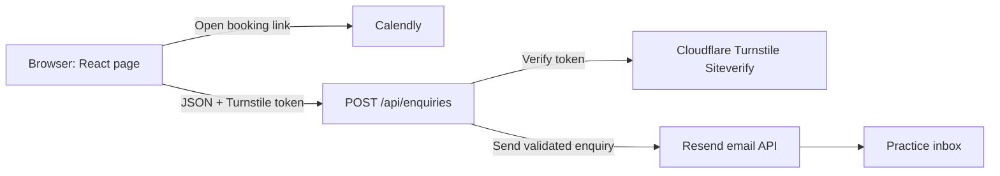

# Swaraagam developer guide

> **Standalone handoff note:** Use [DEPLOY_YOURSELF.md](./DEPLOY_YOURSELF.md) as the source of truth for deployment and current bindings. This reference contains historical notes from before the active D1-backed enquiry flow; the current API requires the `DB` binding described in the deployment guide.

This guide explains the application for a developer coming from Java/Spring with limited frontend experience. It focuses on the code that is active today, how a browser request moves through the system, and the safest places to make common changes.

## 1. What this application is

Swaraagam is a single-page therapy-practice website with two interactive paths:

- Visitors can open an external Calendly page to book a consultation.
- Visitors can submit an enquiry form. The browser obtains a Cloudflare Turnstile token, sends JSON to the application's API route, and the server sends the enquiry to the practice through Resend.

The application is full-stack TypeScript. React renders the interface, a Next.js-compatible App Router supplies page and API conventions, vinext/Vite builds it, and a Cloudflare Worker runs the deployed server code.

There is currently no application database in use. Enquiries are emailed and are not written to D1, a file, or browser storage.

## 2. Java/Spring-to-this-project mental map

| Java/Spring concept | Closest concept here | Project example |
| --- | --- | --- |
| `pom.xml` / `build.gradle` | dependency and script manifest | `package.json` |
| Maven/Gradle wrapper command | npm script | `npm run build` |
| Java source package | source directory | `app/`, `db/`, `worker/` |
| `@RestController` method | route-handler function | `POST()` in `app/api/enquiries/route.ts` |
| Request DTO | TypeScript type plus runtime parsing | `Enquiry` and `parseEnquiry()` |
| Bean Validation | explicit validation in code | `parseEnquiry()` |
| Thymeleaf template plus browser JavaScript | React component written in JSX/TSX | `app/page.tsx` |
| Base page template | root layout | `app/layout.tsx` |
| application properties/environment variables | `.env.local` and deployment secrets | `.env.example` |
| JPA entity/schema | Drizzle table definition | `db/schema.ts` (currently empty) |
| application entry/servlet adapter | Worker `fetch()` entry point | `worker/index.ts` |
| JUnit | Node's built-in test runner | `tests/rendered-html.test.mjs` |

The analogy is useful, but one difference matters: React component state lives in one visitor's browser tab. It is not a singleton server bean and is not shared with another visitor.

## 3. Technology stack

- **TypeScript 5**: JavaScript with compile-time types. Types help during development but are erased from the generated JavaScript.
- **React 19**: component and state model for the page.
- **Next.js App Router conventions**: file-based pages, layouts, metadata, and API routes.
- **vinext + Vite**: builds the Next-style application for a Cloudflare runtime.
- **Tailwind CSS 4 plus custom CSS**: Tailwind utilities are available, but most of this site's visual design is custom CSS.
- **Cloudflare Workers**: deployed server runtime.
- **Cloudflare Turnstile**: bot check for the enquiry form.
- **Resend**: outbound email provider.
- **Calendly**: external appointment scheduling.
- **Drizzle ORM + Cloudflare D1**: included as optional scaffolding; not used by the active application.

Node.js `>=22.13.0` is required.

## 4. Repository tour

```text
.
├── app/
│   ├── api/enquiries/route.ts  # Server-side enquiry endpoint
│   ├── chatgpt-auth.ts         # Optional auth helpers; not used by the home page
│   ├── globals.css             # Design system, layout, responsive rules, animation
│   ├── layout.tsx              # Root HTML shell and SEO/social metadata
│   └── page.tsx                # Home page, interaction state, form submission
├── db/
│   ├── index.ts                # Creates a Drizzle client if D1 is enabled
│   └── schema.ts               # Empty; no active database tables
├── drizzle/                    # Generated migration metadata
├── examples/d1/                # Example only, not part of the live route flow
├── public/                     # Static files served by URL from the site root
├── tests/rendered-html.test.mjs# Render and API behaviour tests
├── worker/index.ts             # Cloudflare Worker entry and image optimization
├── .openai/hosting.json        # Hosting project and optional binding declarations
├── .env.example                # Environment variable template; contains no real secrets
├── drizzle.config.ts           # Drizzle migration generator configuration
├── next.config.ts              # Next-compatible configuration
├── vite.config.ts              # vinext, Sites, and Cloudflare build plugins
├── package.json                # Dependencies and commands
└── PRODUCTION_READINESS.md     # Launch, privacy, security, and operations checklist
```

Generated or local-only directories such as `node_modules/`, `.vinext/`, `dist/`, `.wrangler/`, `outputs/`, and `work/` should not be hand-edited.

## 5. Architecture and request flow



The application has no persistent application-data path in this diagram. Cloudflare D1 becomes relevant only if a future feature explicitly imports `getDb()` and defines tables.

### Enquiry sequence

1. `app/page.tsx` renders the form and loads the Turnstile browser script.
2. Turnstile calls a React callback with a short-lived token.
3. `handleSubmit()` prevents the browser's normal form post and calls `fetch("/api/enquiries")` with JSON.
4. `app/api/enquiries/route.ts` checks origin, content type, body size, and a local attempt limit.
5. The route parses, normalizes, and validates every field. Browser validation is treated only as a convenience.
6. The route sends the token to Turnstile Siteverify.
7. If verification succeeds, the route sends an escaped HTML email and a plain-text email through Resend.
8. The API returns `202 Accepted`; React resets the form and displays the success state.
9. Failures return a safe message plus a request ID. Submitted personal data is not intentionally written to server logs.

## 6. Understanding the frontend

### 6.1 TSX and JSX

Files ending in `.tsx` contain TypeScript and JSX. JSX looks like HTML but is an expression syntax that React converts into element-creation calls.

```tsx
const title = "Counselling";
return <h3 className="card-title">{title}</h3>;
```

Key differences from HTML/templates:

- Use `className`, not `class`.
- JavaScript/TypeScript expressions go inside `{}`.
- Event handlers receive functions: `onClick={() => doSomething()}`.
- Tags must close: `<input />` and `<div></div>`.
- Lists are normally produced with `.map(...)`, comparable to a template `forEach`.
- A repeated React element needs a stable `key`, such as `key={item.title}`.

### 6.2 Components

`Home()` in `app/page.tsx` is a React function component. It returns the page's element tree. When its state changes, React calls the component again and updates only the necessary DOM nodes.

The page is currently one large component. The `modalities` and `steps` arrays near the top are data models used to generate repeated cards. As the site grows, coherent sections such as `BookingForm` or `ModalitiesSection` can be extracted into files under `app/components/` without changing the API.

### 6.3 Client and server code

The first line of `app/page.tsx` is:

```tsx
"use client";
```

This is required because the page uses browser features, event handlers, and React hooks. A Client Component can be pre-rendered into initial HTML, but its interaction logic is downloaded and **hydrated** in the browser.

`app/layout.tsx` has no `"use client"` marker and is server code. It reads request headers to generate the correct absolute URL for social metadata.

`app/api/enquiries/route.ts` is server-only. Secret keys are allowed there and must never be moved into `app/page.tsx`.

### 6.4 State: `useState`

The page declares five state values:

| State | Purpose |
| --- | --- |
| `submitted` | shows the success message |
| `calendarNote` | shows fallback scheduling information when no Calendly URL exists |
| `isSubmitting` | disables repeat submission and changes button text |
| `formError` | shows the latest visitor-safe error |
| `turnstileToken` | holds the current bot-check token |

Calling a setter such as `setIsSubmitting(true)` schedules a render. It does not mutate a field in place, and the new state should not be assumed to be synchronously available on the next line.

### 6.5 Lifecycle work: `useEffect`

`useEffect(callback, [])` runs after the component mounts in the browser and cleans up when it unmounts. The empty dependency array means "set this up once for this mount."

The page has two effects:

- An `IntersectionObserver` adds `is-visible` when marked sections enter the viewport.
- A Turnstile effect loads the external script, renders its widget, registers callbacks, and removes the widget during cleanup.

Effects should not be used for values that can be calculated directly during rendering. They are intended for synchronization with systems outside React, such as browser APIs and third-party widgets.

### 6.6 DOM references: `useRef`

`turnstileContainerRef` gives Turnstile an actual DOM element to render into. `turnstileWidgetIdRef` remembers the provider's widget ID without causing a render when it changes.

In general, let React own the DOM. Direct DOM operations are justified here because Turnstile and `IntersectionObserver` are external browser APIs.

### 6.7 Form handling

The form combines two levels of validation:

- HTML attributes such as `required`, `minLength`, `maxLength`, and `type="email"` give visitors immediate feedback.
- The API repeats all meaningful validation because browser requests can be forged or modified.

`new FormData(form)` reads named inputs. `JSON.stringify(...)` produces the request DTO. `fetch(...)` returns a `Promise`; `await` pauses this async function until the response is available without blocking the browser UI thread.

The hidden `website` field is a honeypot. Humans do not see it, but simple bots may fill it. The server silently accepts such a request without contacting Turnstile or Resend.

## 7. Styling and responsive design

All global styling is in `app/globals.css`.

### Design tokens

The `:root` block defines reusable CSS variables such as:

```css
:root {
  --cream: #f7f3eb;
  --ink: #24332d;
  --sage-deep: #4d6758;
  --font-display: Georgia, "Times New Roman", serif;
}
```

Change these variables to adjust the site-wide palette or fonts. This is similar to changing central theme constants rather than editing every component.

### Custom classes and Tailwind utilities

Most elements use semantic custom classes such as `hero-section`, `modality-card`, and `contact-form`. A few layout utilities, for example `flex`, `gap-5`, and `md:flex`, come from Tailwind.

Tailwind is enabled by `@import "tailwindcss";`. There is no separate Tailwind configuration file because Tailwind 4 can discover utilities from the source and accepts theme values through CSS.

### Responsive rules

Media queries at the end of `globals.css` adjust grids, spacing, navigation, and form layout for smaller screens. Read rules from broad/default styles first, then check matching `@media (max-width: ...)` overrides before changing a layout.

The `prefers-reduced-motion` rule is an accessibility feature. It removes reveal animation for visitors who request reduced motion.

### Accessibility already present

The page includes semantic sections and headings, labels connected to form fields, a keyboard skip link, visible focus styles, status/alert live regions, reduced-motion support, and explanatory screen-reader-only text. Preserve these when modifying markup.

## 8. Server API contract

### Endpoint

`POST /api/enquiries`

Request header:

```http
Content-Type: application/json
```

Request body:

```json
{
  "name": "Test Visitor",
  "email": "visitor@example.com",
  "service": "Counselling",
  "note": "A short optional note.",
  "website": "",
  "consent": true,
  "turnstileToken": "provider-token"
}
```

Allowed `service` values are:

- `Counselling`
- `Arts-Based Therapy`
- `Musical Therapy`
- `I'm not sure yet`

Successful response:

```http
HTTP/1.1 202 Accepted
Cache-Control: no-store
Content-Type: application/json
```

```json
{
  "ok": true,
  "requestId": "generated-uuid"
}
```

Error response shape:

```json
{
  "error": "Visitor-safe explanation",
  "requestId": "generated-uuid"
}
```

### Status codes

| Status | Meaning in this API |
| --- | --- |
| `202` | accepted for email delivery, or silently accepted honeypot submission |
| `400` | unreadable JSON or failed/expired Turnstile check |
| `403` | browser origin is not allowed |
| `405` | `GET` is not supported; use `POST` |
| `413` | body exceeds 12,000 bytes |
| `415` | content type is not JSON |
| `422` | field or consent validation failed |
| `429` | more than five attempts in a 15-minute local window |
| `503` | Turnstile/email is unconfigured, unavailable, timed out, or rejected |

Every response uses `Cache-Control: no-store`.

### Validation and security details

- Single-line values are Unicode-normalized, control characters are removed, whitespace is collapsed, and lengths are bounded.
- Notes preserve limited line breaks and are restricted to 600 characters.
- Email output is HTML-escaped before interpolation.
- Browser origins are compared with the request origin and `ALLOWED_ORIGINS`.
- Client identifiers are salted and SHA-256 hashed before entering the in-memory rate-limit map.
- The Turnstile response must be successful, have action `enquiry`, and optionally match an expected hostname.
- Provider calls have 8-second and 10-second timeouts.
- Resend receives an idempotency key based on the API request ID.

The rate limiter is best-effort and local to a Worker isolate. It is not a global production limit. The production environment should also have an edge rate-limit rule.

## 9. Configuration

Copy `.env.example` to `.env.local` for local development:

```powershell
Copy-Item .env.example .env.local
```

| Variable | Used by | Secret? | Purpose |
| --- | --- | --- | --- |
| `NEXT_PUBLIC_TURNSTILE_SITE_KEY` | browser | no | renders the Turnstile widget |
| `NEXT_PUBLIC_CALENDLY_URL` | browser | no | external scheduling URL |
| `TURNSTILE_SECRET_KEY` | API | yes | verifies Turnstile tokens |
| `TURNSTILE_EXPECTED_HOSTNAMES` | API | no, server-only | accepted token hostnames |
| `RESEND_API_KEY` | API | yes | authenticates to Resend |
| `ENQUIRY_TO_EMAIL` | API | private config | comma-separated recipients, maximum five |
| `ENQUIRY_FROM_EMAIL` | API | private config | verified sender address |
| `RATE_LIMIT_SALT` | API | yes | makes rate-limit hashes environment-specific |
| `ALLOWED_ORIGINS` | API | private config | extra comma-separated browser origins |

Anything prefixed with `NEXT_PUBLIC_` can be embedded in browser JavaScript and must be considered public. Changing a public value requires a rebuild. Never add the prefix to a secret.

`app/page.tsx` currently has fallback values for the public Turnstile site key and Calendly URL. Environment values take precedence. Server secrets have no production fallback; if they are missing, the enquiry route returns a generic `503`.

Do not commit `.env.local`. The repository's `.gitignore` excludes `.env*` except `.env.example`.

## 10. Running the application locally

From the repository root:

```powershell
# Use the exact dependency versions from package-lock.json
npm ci

# Start the development server with hot reload
npm run dev
```

Open the local URL printed by the command, normally `http://localhost:3000`.

Useful commands:

| Command | Purpose |
| --- | --- |
| `npm run dev` | local development server and hot reload |
| `npm run lint` | ESLint static checks |
| `npm run build` | production vinext/Cloudflare build |
| `npm test` | production build followed by Node render/API tests |
| `npm run db:generate` | generate migrations after an intentional schema change |

The Turnstile values in `.env.example` are Cloudflare test values suitable for local development only. Resend remains intentionally unconfigured until a real key, sender, and recipient are supplied, so a complete email delivery test needs provider configuration.

## 11. Tests

`tests/rendered-html.test.mjs` imports the built Worker and makes in-memory HTTP requests to it. The suite verifies:

- the expected home page and configured Calendly link render;
- the endpoint rejects unsupported methods, origins, content types, and large bodies;
- field, service, note-length, and consent validation;
- honeypot behaviour;
- safe failure when external providers are not configured;
- the local attempt limit without exposing the source IP.

This is closer to a Spring `MockMvc` integration test than a browser end-to-end test. It does not run a real browser, solve a Turnstile challenge, or send a real email.

Before handing off a code change, run:

```powershell
npm run lint
npm test
```

## 12. Common change recipes

### Change visible wording

Edit `app/page.tsx`. Most page copy is directly inside JSX. Repeated modality and process content is in the `modalities` and `steps` arrays near the top.

### Change colours or fonts

Start with the variables in the `:root` block of `app/globals.css`. Check desktop and mobile widths after the change.

### Add or rename a modality

Update both locations:

1. The `modalities` array and `<select>` options in `app/page.tsx`.
2. The `SERVICES` set in `app/api/enquiries/route.ts`.

If only the UI is changed, the server will correctly reject the new value. This duplication behaves like keeping a frontend enum and backend validation enum in sync.

### Add an enquiry field

Update the full path, not just the form:

1. Add the labelled control in `app/page.tsx`.
2. Add it to the JSON object in `handleSubmit()`.
3. Extend the `Enquiry` type in the API route.
4. Normalize and validate it in `parseEnquiry()`.
5. Add escaped HTML and plain-text representations to `sendEnquiryEmail()`.
6. Add tests for valid, missing, boundary, and malicious values.
7. Revisit the privacy wording and confirm the field is genuinely necessary.

### Change the Calendly event

Set `NEXT_PUBLIC_CALENDLY_URL` in the environment and rebuild. Avoid hard-coding another environment's URL into JSX.

### Add a new page

Create a folder below `app/` containing `page.tsx`. For example, `app/privacy/page.tsx` maps to `/privacy`. Keep it a server component unless it truly needs browser state, hooks, or event handlers.

### Add database persistence

Do this only when the product and privacy requirements explicitly call for it:

1. Declare tables in `db/schema.ts`.
2. Set the D1 binding name, normally `DB`, in `.openai/hosting.json` or the deployment control plane.
3. Run `npm run db:generate` and review the generated migration.
4. Import `getDb()` only from server code.
5. Add retention, deletion, authorization, migration, backup, and privacy handling.

Do not casually persist enquiry notes. The current design intentionally avoids an application copy of potentially sensitive information.

## 13. Common mistakes for Java developers new to React

- **Putting secrets in page code:** anything in a Client Component or named `NEXT_PUBLIC_*` is visible to visitors.
- **Expecting state setters to work like field assignment:** React batches state updates and renders from a state snapshot.
- **Mutating arrays or objects in state:** create a new array/object so React can detect the change.
- **Calling hooks conditionally:** `useState`, `useEffect`, and other hooks must remain at the top level of a component.
- **Running side effects while rendering:** network calls, subscriptions, and DOM integration belong in event handlers, server code, or effects.
- **Trusting browser validation:** repeat validation and authorization on the server.
- **Using browser-only globals on the server:** `window`, `document`, and `localStorage` exist only in the browser.
- **Forgetting cleanup:** observers, event listeners, timers, and third-party widgets should be removed by an effect cleanup function.
- **Changing generated output:** edit source files, then rebuild; never patch `dist/` or `.vinext/`.
- **Assuming database scaffolding means storage:** no active route imports `getDb()`, and the current schema is empty.

## 14. Debugging guide

### The page does not build

Read the first TypeScript or ESLint error, including its source file and line. Later errors are often consequences of the first one. Common JSX failures are an unclosed tag or mismatched `{}`.

### A click or state change does nothing

Open browser developer tools and check the Console. Confirm that the component is a Client Component, the handler is passed as a function, and the button is not disabled.

### The enquiry fails

In browser developer tools, open **Network**, select `POST /api/enquiries`, and inspect:

- request JSON;
- response status;
- response JSON and request ID;
- whether Turnstile supplied a token.

Then use the request ID to correlate server/provider logs. Do not add names, email addresses, or notes to diagnostic logging.

Typical meanings:

- `400`: invalid JSON or Turnstile failure/expiry;
- `403`: `ALLOWED_ORIGINS` does not include the browser origin;
- `422`: browser and API DTO values are out of sync;
- `429`: too many attempts from the same local client identifier;
- `503`: missing secret/provider configuration, timeout, or provider rejection.

### Styling differs by screen size

Inspect the element's computed styles and find the winning rule. Then search `app/globals.css` for the class and review later media-query overrides.

## 15. Deployment model

`worker/index.ts` is the Cloudflare entry point. It handles the vinext image-optimization path and delegates all other requests to the generated App Router handler.

`vite.config.ts` combines:

- the vinext application plugin;
- the Sites build plugin;
- the Cloudflare Vite plugin and local Worker bindings.

`.openai/hosting.json` identifies the hosting project and declares optional D1/R2 binding names. Both bindings are currently `null`, which matches the no-database/no-object-storage design.

Deployment configuration and secrets belong in the hosting environment. For go-live requirements, security hardening, privacy operations, provider setup, and the launch checklist, read `PRODUCTION_READINESS.md`.

## 16. Optional and inactive code

`app/chatgpt-auth.ts` contains safe helpers for optional Sign in with ChatGPT. The current public home page does not import these helpers and does not require sign-in.

The `examples/d1/` directory demonstrates D1 usage but does not automatically create routes in the active application. Treat it as reference material.

## 17. Recommended reading order for your first change

1. `package.json` — learn the available commands and dependencies.
2. `app/page.tsx` — follow the data, state, effects, markup, and form submission.
3. `app/globals.css` — connect JSX class names to their styles and responsive overrides.
4. `app/api/enquiries/route.ts` — follow the server validation and provider calls.
5. `tests/rendered-html.test.mjs` — see the externally observable behaviour.
6. `vite.config.ts` and `worker/index.ts` — understand build/runtime integration last.

For a safe first exercise, change one piece of page copy, run `npm run lint` and `npm test`, then inspect the result with `npm run dev` at desktop and mobile widths.
